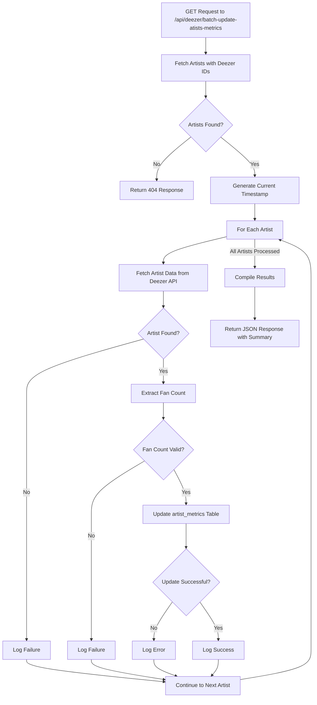

# Artist Processing System

## Batch Artist Processing Flow

### Overview
The batch artist processing system enables real-time tracking of multiple artist imports using Server-Sent Events (SSE) and Redis for progress updates.

### Key Components

#### Frontend Components

1. **BatchArtistSelect** (`components/features/batch/batch-artist-select.tsx`)
   ```typescript
   // State Management
   const [selectedArtists, setSelectedArtists] = useState<SpotifyArtist[]>([]);
   const [processingArtists, setProcessingArtists] = useState<Map<string, EventSource>>();
   const [processingStatuses, setProcessingStatuses] = useState<Map<string, ProgressUpdate>>();
   ```
   - Manages artist selection queue
   - Handles real-time progress tracking
   - Maintains processing state

2. **ArtistProgress** (`components/features/progress/artist-progress.tsx`)
   ```typescript
   interface ArtistProgressProps {
     status: ProgressUpdate;
   }
   ```
   - Displays real-time progress updates
   - Shows success/error states
   - Progress bar visualization

#### API Routes

1. **Batch Processing** (`app/api/artists/batch-artist-full/route.ts`)
   - Initiates background processing
   - Processing stages:
     ```typescript
     const STAGES = {
       INIT: 'Adding Artist',
       METADATA: 'Processing Metadata',
       ANALYTICS: 'Processing Analytics',
       MEDIA: 'Processing Media',
       STORE: 'Saving Data',
       COMPLETE: 'Complete',
       ERROR: 'Error'
     }
     ```

2. **Progress Tracking** (`app/api/artists/progress/[spotify_id]/route.ts`)
   - SSE endpoint for progress updates
   - Redis integration for status storage
   - Real-time update streaming

### Data Flow

1. **Selection Process**
   ```
   User Selection → BatchArtistSelect → Queue for Processing
   ```

2. **Processing Flow**
   ```
   API Request → Background Processing → Redis Updates → SSE → UI Update
   ```

3. **Progress Updates**
   ```
   Background Process → Redis → SSE Stream → Progress Display
   ```

### Progress Stages

| Stage | Description |
|-------|-------------|
| INIT | Process initialization |
| METADATA | Fetching artist metadata |
| ANALYTICS | Processing analytics data |
| MEDIA | Processing media content |
| STORE | Database operations |
| COMPLETE | Process completed |
| ERROR | Process failed |

### Error Handling

1. **Connection Errors**
   - EventSource connection timeout
   - Redis connection issues
   - API request failures

2. **Processing Errors**
   - Stage-specific errors
   - Database operation failures
   - Timeout handling

### Types

## Deezer Metrics Update Flow

The Deezer metrics update process fetches fan counts for artists and stores them in the metrics database.



### Key Components:

1. **Data Retrieval**
   - Fetches artists with Deezer platform IDs from the database
   - Calls Deezer API to get current fan counts

2. **Data Processing**
   - Extracts fan count from Deezer API response
   - Validates data before database insertion

3. **Database Update**
   - Stores fan counts as 'followers' metric type
   - Uses upsert with conflict resolution for idempotent updates

4. **Error Handling**
   - Handles missing artists
   - Manages API failures
   - Tracks individual artist update status

5. **Response**
   - Returns summary statistics
   - Includes detailed success/failure information
