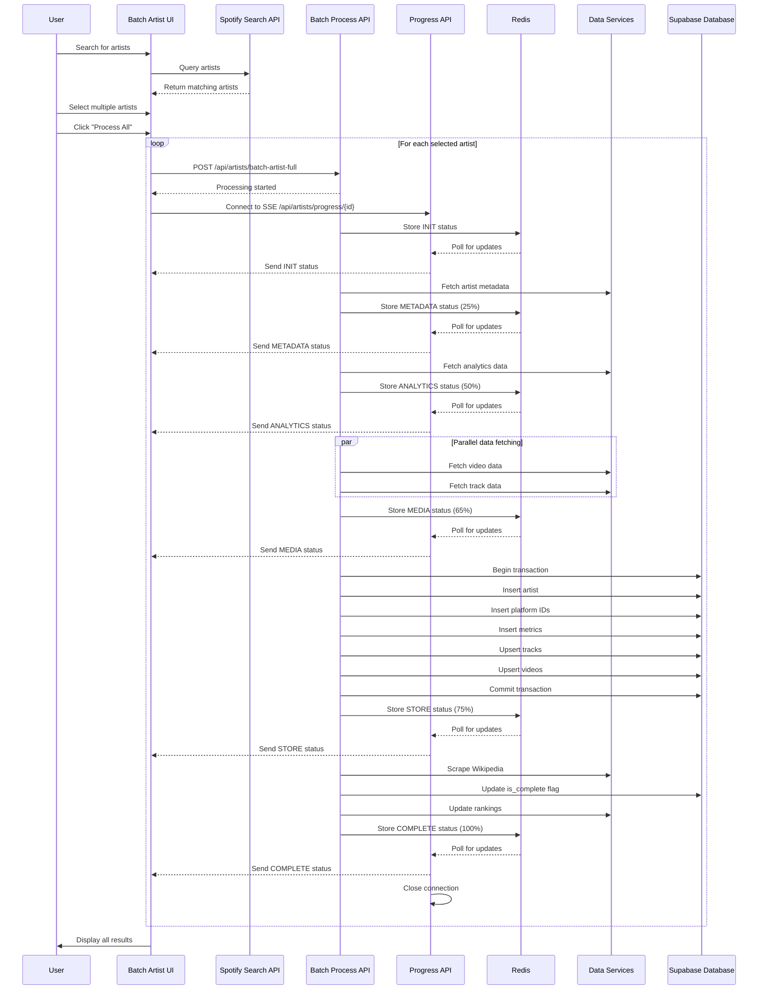
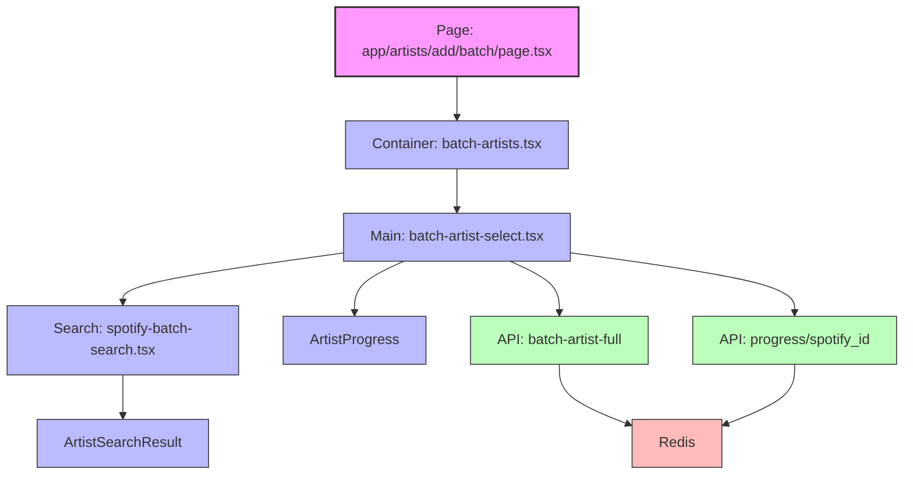
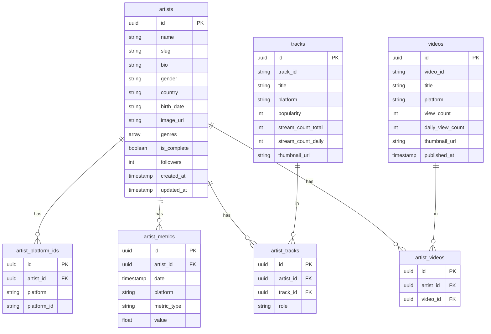

# Batch Artist Addition Feature

This document explains how the batch artist addition feature works in the Audiograph Supabase Admin application.

## Table of Contents

- [Process Flow Diagram](#process-flow-diagram)
- [Overview](#overview)
- [Component Structure](#component-structure)
- [API Endpoints](#api-endpoints)
- [Data Flow](#data-flow)
- [Progress Stages](#progress-stages)
- [Redis for Progress Tracking](#redis-for-progress-tracking)
- [Error Handling](#error-handling)
- [Database Operations](#database-operations)
  - [Data Model](#data-model)
  - [Database Operations](#database-operations-1)
- [Usage Instructions](#usage-instructions)
  - [Accessing the Batch Artist Addition Feature](#accessing-the-batch-artist-addition-feature)
  - [Adding Artists in Batch](#adding-artists-in-batch)
  - [Tips for Batch Processing](#tips-for-batch-processing)
- [Troubleshooting](#troubleshooting)
  - [Common Issues and Solutions](#common-issues-and-solutions)
  - [Checking Logs](#checking-logs)
  - [Redis Monitoring](#redis-monitoring)
  - [Recovering from Errors](#recovering-from-errors)
- [Future Enhancements](#future-enhancements)
  - [Performance Improvements](#performance-improvements)
  - [User Experience Enhancements](#user-experience-enhancements)
  - [Feature Additions](#feature-additions)
- [Conclusion](#conclusion)

## Process Flow Diagram



## Overview

The batch artist addition feature allows administrators to search for and add multiple artists from Spotify to the Audiograph database in a single operation. The system handles the entire process from artist selection to data fetching, processing, and storage, with real-time progress tracking.

## Component Structure

The feature is organized into the following components:



1. **Page Component**: `app/artists/add/batch/page.tsx`
   - Renders the batch artist addition page
   - Uses the `BatchArtists` component

2. **Container Component**: `components/features/batch/batch-artists.tsx`
   - Provides the UI container for the batch artist selection
   - Renders the `BatchArtistSelect` component within a card

3. **Main Component**: `components/features/batch/batch-artist-select.tsx`
   - Core component that handles artist selection and processing
   - Manages the list of selected artists
   - Initiates the processing of artists
   - Displays processing status for each artist

4. **Search Component**: `components/features/spotify-search/spotify-batch-search.tsx`
   - Provides the search interface for finding artists on Spotify
   - Filters out artists that already exist in the database
   - Allows selection of artists to add

5. **Progress Component**: `components/features/progress/artist-progress.tsx`
   - Displays the current processing status for each artist
   - Shows progress bar, stage information, and error/success states

## API Endpoints

The feature uses the following API endpoints:

1. **Spotify Search**: `app/api/spotify/search/route.ts`
   - Searches Spotify for artists matching a query
   - Returns artist data including name, image, genres, popularity, and followers

2. **Batch Artist Processing**: `app/api/artists/batch-artist-full/route.ts`
   - Initiates the processing of an artist
   - Handles data fetching, transformation, and storage
   - Sends progress updates to Redis

3. **Progress Tracking**: `app/api/artists/progress/[spotify_id]/route.ts`
   - Creates a Server-Sent Events (SSE) connection for real-time progress updates
   - Retrieves progress data from Redis
   - Sends updates to the client as they occur

## Data Flow

The batch artist addition process follows these steps:

1. **Artist Search and Selection**:
   - User searches for artists using the Spotify API
   - Artists already in the database are filtered out
   - User selects multiple artists to add

2. **Processing Initiation**:
   - When the user clicks "Process All", the system processes each selected artist in parallel
   - For each artist, an API call is made to `/api/artists/batch-artist-full`
   - A progress tracking connection is established via `/api/artists/progress/[spotify_id]`

3. **Data Collection**:
   - The system fetches artist metadata from various sources:
     - Basic info from Spotify (name, image, genres, popularity, followers)
     - Detailed metadata (bio, gender, country, birth date)
     - Analytics data from Viberate
     - Video data from YouTube and Kworb
     - Track data from Spotify and Kworb

4. **Data Storage**:
   - The collected data is stored in the database using a transaction
   - The process includes:
     - Inserting the artist record
     - Adding platform IDs
     - Adding metrics data
     - Adding tracks and artist-track relationships
     - Adding videos and artist-video relationships
     - Scraping and storing Wikipedia data
     - Updating rankings

5. **Progress Tracking**:
   - Throughout the process, progress updates are sent to Redis
   - The client receives these updates in real-time via SSE
   - The UI displays the current stage, progress percentage, and status messages

## Progress Stages

The system tracks progress through the following stages:

1. **INIT**: Initial setup and validation
2. **METADATA**: Fetching artist metadata from Spotify and other sources
3. **ANALYTICS**: Processing analytics data from Viberate
4. **MEDIA**: Processing media data (videos and tracks)
5. **STORE**: Saving data to the database
6. **COMPLETE**: Process completed successfully
7. **ERROR**: An error occurred during processing

## Redis for Progress Tracking

The system uses Redis to store and retrieve progress updates:

1. **Storage**: Progress updates are stored in Redis with keys in the format `artist:progress:{spotify_id}`
2. **Retrieval**: The progress API endpoint polls Redis for updates
3. **Expiration**: Progress data automatically expires after completion or error (5 minutes)

## Error Handling

The system includes robust error handling:

1. **API Errors**: Errors in API calls are caught and reported
2. **Processing Errors**: Errors during data processing are tracked and displayed
3. **Transaction Rollback**: Database transactions are rolled back on error
4. **Connection Timeouts**: SSE connections have timeout handling

## Database Operations

### Data Model



### Database Operations

The system performs the following database operations:

1. **Transaction Management**:
   - Begins a transaction with retry logic
   - Commits or rolls back based on success/failure

2. **Data Insertion**:
   - Inserts artist record
   - Inserts platform IDs
   - Inserts metrics data
   - Upserts tracks and artist-track relationships
   - Upserts videos and artist-video relationships

3. **Post-Processing**:
   - Updates the artist's `is_complete` flag
   - Triggers Wikipedia data scraping and storage
   - Updates artist rankings

## Usage Instructions

### Accessing the Batch Artist Addition Feature

1. Navigate to the admin dashboard
2. Go to the "Artists" section
3. Click on "Add Artists" in the navigation menu
4. Select "Batch Add" to access the batch artist addition page

### Adding Artists in Batch

1. **Search for Artists**:
   - Use the search box to find artists on Spotify
   - Type an artist name and wait for results to appear
   - Artists already in your database will be filtered out automatically

2. **Select Artists**:
   - Click on an artist in the search results to add them to your selection
   - Selected artists will appear in the "Selected Artists" section below
   - You can remove artists from your selection by clicking the X button

3. **Process Artists**:
   - Once you've selected all the artists you want to add, click the "Process All" button
   - The system will begin processing each artist in parallel
   - You'll see real-time progress updates for each artist

4. **Monitor Progress**:
   - Each artist will have its own progress card showing the current stage and percentage
   - The progress bar will update in real-time as the artist is processed
   - You'll see success or error messages for each artist

5. **View Results**:
   - Successfully added artists will show a completion message
   - For any errors, you'll see detailed error messages
   - You can navigate to the artist's page by clicking on the link that appears after successful processing

### Tips for Batch Processing

- **Optimal Batch Size**: For best performance, process 5-10 artists at a time
- **Network Considerations**: Each artist requires multiple API calls, so ensure you have a stable internet connection
- **Error Handling**: If an artist fails to process, you can try again individually later
- **Duplicate Prevention**: The system automatically prevents adding artists that already exist in the database
- **Processing Time**: Depending on the artist's popularity and data availability, processing can take 30 seconds to 2 minutes per artist

## Troubleshooting

### Common Issues and Solutions

| Issue | Possible Causes | Solutions |
|-------|----------------|-----------|
| **Artist search returns no results** | - Spotify API rate limit<br>- Network connectivity<br>- Misspelled artist name | - Wait a few minutes and try again<br>- Check your internet connection<br>- Verify the spelling of the artist name |
| **"Processing started" but no progress updates** | - Redis connection issue<br>- Server-side processing error | - Refresh the page and try again<br>- Check Redis server status<br>- Check server logs for errors |
| **Error: "Failed to fetch metadata"** | - External API unavailability<br>- Artist not found in metadata sources | - Try again later<br>- Try adding the artist individually<br>- Check if the artist exists on Spotify |
| **Error: "Failed to process artist"** | - Timeout during processing<br>- Error in one of the data sources | - Try again with fewer artists at once<br>- Check server logs for specific errors |
| **Transaction errors** | - Database connectivity issues<br>- Constraint violations | - Check database connection<br>- Verify the artist doesn't already exist<br>- Check server logs for specific SQL errors |
| **Slow processing** | - Large number of artists<br>- Network latency<br>- External API slowness | - Process fewer artists at once<br>- Ensure good network connectivity<br>- Be patient during peak hours |

### Checking Logs

If you encounter issues, check the following logs:

1. **Browser Console Logs**: Open your browser's developer tools (F12) and check the Console tab for client-side errors
2. **Server Logs**: Check the Next.js server logs for API errors
3. **Redis Logs**: Check Redis logs for connection or data storage issues

### Redis Monitoring

You can monitor Redis keys for debugging:

```bash
# Connect to Redis CLI
redis-cli

# List all artist progress keys
keys artist:progress:*

# Get the current progress for a specific artist
get artist:progress:{spotify_id}
```

### Recovering from Errors

If an artist fails to process:

1. Note the specific error message
2. Check if the artist was partially added to the database
3. If needed, manually delete any partial data using the Supabase dashboard
4. Try adding the artist again individually rather than in batch
5. If the issue persists, try using the single artist addition feature instead

## Future Enhancements

The batch artist addition feature could be improved with the following enhancements:

### Performance Improvements

1. **Caching Optimization**:
   - Implement more aggressive caching for external API responses
   - Use a shared cache for common data across artists (e.g., genre information)
   - Add cache warming for frequently accessed data

2. **Parallel Processing**:
   - Optimize parallel data fetching with better concurrency control
   - Implement worker threads or serverless functions for distributed processing
   - Add queue management to prevent overloading external APIs

3. **Database Optimization**:
   - Use bulk inserts for better database performance
   - Optimize transaction management with more efficient locking strategies
   - Implement database connection pooling for better resource utilization

### User Experience Enhancements

1. **Improved Selection Interface**:
   - Add drag-and-drop functionality for artist selection
   - Implement batch selection from search results
   - Add sorting and filtering options for selected artists

2. **Enhanced Progress Tracking**:
   - Add estimated time remaining for each artist
   - Implement a global progress indicator for the entire batch
   - Add more detailed progress information for each stage

3. **Error Recovery**:
   - Add automatic retry for failed artists
   - Implement partial data recovery for partially processed artists
   - Add the ability to resume processing from a specific stage

### Feature Additions

1. **Import/Export**:
   - Add CSV/JSON import for batch artist processing
   - Implement export functionality for processed artists
   - Add integration with external artist databases

2. **Scheduling**:
   - Add the ability to schedule batch processing for off-peak hours
   - Implement recurring batch processing for regular updates
   - Add email notifications for completed batch processes

3. **Analytics**:
   - Add processing statistics and performance metrics
   - Implement dashboards for monitoring batch processing
   - Add historical data for batch processing performance

## Conclusion

The batch artist addition feature provides a streamlined way to add multiple artists to the Audiograph database with comprehensive data collection and real-time progress tracking. The system is designed to handle errors gracefully and ensure data consistency through transaction management.
