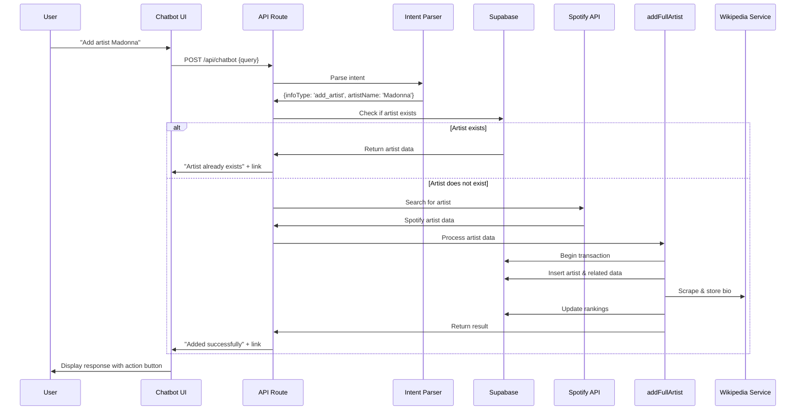

# Adding Artist Functionality to the Chatbot

This document outlines how to extend the chatbot to support adding new artists to the database through natural language conversations.

## Flow Diagram



## Overview

The existing chatbot can answer questions about artists. We can enhance it to perform actions like adding new artists by leveraging our existing artist addition infrastructure through a conversational interface.

## Implementation Process

### 1. Extend the Intent Parser

Modify the `parseQuery` function in `app/api/chatbot/route.ts` to detect "add artist" intents:

```typescript
function parseQuery(query: string) {
  // Existing normalization code...
  const normalizedQuery = query.toLowerCase().trim();
  
  // Extract artist name
  let artistName = null;
  
  // Check for adding artist patterns
  if (normalizedQuery.includes('add artist') || 
      normalizedQuery.includes('create artist') || 
      normalizedQuery.includes('new artist')) {
    // Extract artist name after the add/create command
    const matches = normalizedQuery.match(/(?:add|create|new)\s+artist\s+([a-z0-9\s&]+)(?:\s|$)/i);
    if (matches && matches[1]) {
      artistName = matches[1].trim();
      return { artistName, infoType: 'add_artist' };
    }
  }
  
  // Existing artist name extraction...
  const nameMatches = normalizedQuery.match(/(about|for|on|of|'s)\s+([a-z\s&]+)(\s+|$)/i);
  if (nameMatches && nameMatches[2]) {
    artistName = nameMatches[2].trim();
  }
  
  // Existing info type determination...
  let infoType = 'bio';  // Default to biography
  
  if (normalizedQuery.includes('bio') || normalizedQuery.includes('about')) {
    // Existing code...
  }
  
  return { artistName, infoType };
}
```

### 2. Modify the Route Handler

Add a new case in the switch statement in `app/api/chatbot/route.ts` to handle the "add_artist" intent:

```typescript
// Inside the POST function, add a new case in the switch statement:
case 'add_artist':
  try {
    // Step 1: Call Spotify API to find the artist
    // Use our existing spotify-service
    const spotifyService = new SpotifyService();
    const spotifyResults = await spotifyService.searchArtist(artistName);
    
    if (!spotifyResults || spotifyResults.length === 0) {
      return NextResponse.json({
        response: `I couldn't find an artist named "${artistName}" on Spotify. Please check the spelling and try again.`
      });
    }
    
    // Get first result (most relevant match)
    const spotifyArtist = spotifyResults[0];
    
    // Step 2: Start the full artist collection process
    // This uses our existing service that handles the collection from various sources
    const addArtistService = new AddArtistService();
    const result = await addArtistService.processArtist(spotifyArtist);
    
    if (result.error) {
      return NextResponse.json({
        response: `I had trouble adding ${artistName} to the database: ${result.error}`
      });
    }
    
    // Step 3: Return success with link to artist page
    return NextResponse.json({
      response: `Successfully added ${result.name} to the database!`,
      artist: result,
      hasAction: true,
      action: {
        type: 'link',
        text: 'View Artist Page',
        url: `/artists/${result.slug}`
      }
    });
  } catch (error) {
    console.error('Error adding artist via chatbot:', error);
    return NextResponse.json({
      response: `I encountered an error while trying to add ${artistName}. Please try again later.`
    });
  }
```

### 3. Update the Chat Interface

Update the chat interface component to handle the action and link:

```tsx
// In components/features/chatbot/chat-interface.tsx
// Inside your message rendering logic:

{message.hasAction && message.action.type === 'link' && (
  <div className="mt-3">
    <Button asChild size="sm" variant="outline">
      <Link href={message.action.url}>
        {message.action.text}
      </Link>
    </Button>
  </div>
)}
```

### 4. Add Suggested Prompts

Update the empty state in the chat interface to suggest artist addition:

```tsx
<Button 
  variant="outline" 
  className="text-xs m-1" 
  onClick={() => setInput("Add artist Bruno Mars")}
>
  Add artist Bruno Mars
</Button>
```

## Processing Flow

Here's a detailed breakdown of the complete process:

1. **Intent Detection**:
   - User types "Add artist Dua Lipa"
   - Chatbot parses intent as 'add_artist' and extracts "Dua Lipa" as the artist name

2. **Spotify API Call**:
   - Call Spotify search API to find the artist
   - Extract relevant information (name, id, image, followers, etc.)

3. **Data Collection**:
   - Use our existing service functions to gather data from:
     - Spotify (details, tracks, metrics)
     - YouTube (videos, subscribers)
     - Other platforms (as configured)

4. **Database Storage**:
   - Format collected data according to our schema
   - Store artist information in the database
   - Store related data (tracks, videos, metrics)

5. **Response to User**:
   - Send confirmation message with artist name
   - Include link to the new artist page
   - Show artist image in the chat interface

## Implementation Considerations

- **Error Handling**: Provide clear error messages for each potential failure point
- **Rate Limiting**: Consider implementing rate limits to prevent abuse
- **Authentication**: Ensure only authorized users can add artists
- **Progress Indication**: For longer processes, consider adding progress updates
- **Duplicate Prevention**: Check if artist already exists before processing

## Future Enhancements

1. **Batch Processing**: Allow adding multiple artists at once
2. **Confirmation Step**: Add a confirmation before processing to verify the correct artist
3. **Progress Updates**: Show real-time updates during the multi-step process
4. **Similar Artist Suggestions**: Suggest similar artists that could also be added
5. **Voice Commands**: Support adding artists through voice interface